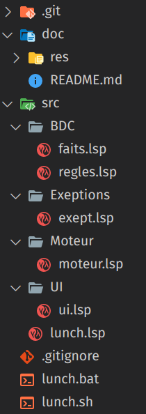
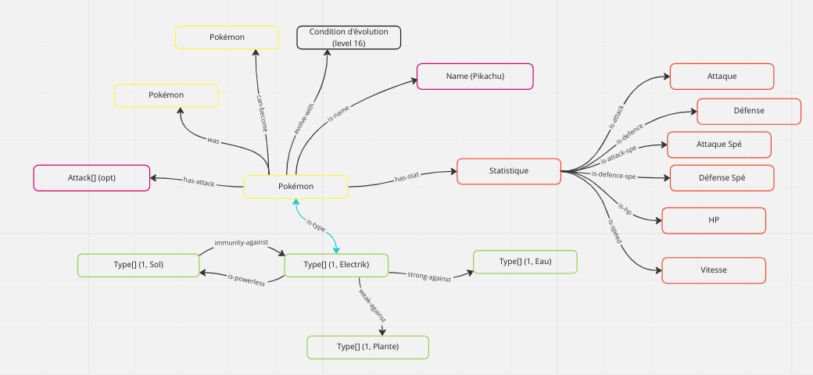
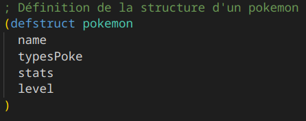
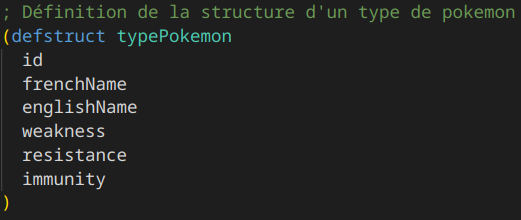

# Info806-TP
TP d'info 806 - Réalisation d'un systeme expert en lisp

## Idées 
- Système de recherche de pokémon
    + Recherche d'un pokémon en rentrant ses caractéristique / nom ou type
        ``` carac|nom|type => pokémon ```
    + Recherche des pokémons efficaces contre un autre
        ``` pokémon => pokémon[] ```
    + Donner les caractéristiques d'un pokémon
        ``` pokémon => carac + type ```
    + Trouver les évolutions précédentes / parents
        ``` pokémon => pokémon[] ```
    + Trouver les conditions pour évoluer
        ``` pokémon => condition[] ```
    + Recherche d'attaque efficace
        ``` Attaque => Attaque[] ```
    + Rechercher les zones d'apparition d'un pokémon 
        ``` pokémon => zone[] ```
        ``` zone => boolean ```

## Architecture
L'architecture de ce projet est la suivante :
| Architecture | Explications |
|---|---|
|  | Dans le dossier doc se trouve toute la documentation (dont ce fichier) <br> Le dossier src contient tout le code source du projet, répartit comme suit : <br> - BDC => Base De Connaissances, regroupe les faits et les règles du système <br> - Exeptions => gère toutes les erreurs et exeptions que nous pouvons rencontrer <br> - Moteur => Moteur d'inférence du système, récupère une requète et récupère les faits, en fonctions des règles établies <br> - UI => Interface Utilisateur, permet d'afficher les résultat du moteur d'inférence, mais lui communique également les requètes <br> les trois fichiers lunch servent à lancer le projet. Le fichier lunch.lsp sert à installer les dépendances du projet + appeler la méthode main. Les fichiers lunch.bat et lunch.sh permettent, quand à eux, de lancer le projet sans effort, respectivement sous Windows et sous linux. |

## Schémas de la base de fait


## Base de Fait
Dans notre base de faits nous utilisons deux structures principales : 
* La structure pokemon qui permet d'avoir les données d'un pokémon 

* La structure typePokemon qui enregistre le type de chaque pokémon


La base de fait se remplis grâce à des requêtes à l'API `PokeAPI`. Les réponses de ces requêtes sont parsées en JSON puis traité, de sorte à remplir les structures.

Le package de la base de fait gère elle-même le traitement des JSON 

## Base de Règles
La base de règle contient toutes les règles que nous utilisons, pour le moment, 3 règles :
* Une règle pour chercher le nom d'un pokemon
* Une règle pour chercher les types, sans avoir de posture choisie
* Une règle pour trouver les types opposés au type du pokémon choisi

## Moteur d'inférence
Le moteur d'inférence fait que boucler dans les règles qui existent, applique les conditions liées à la règle 

## Comment utiliser le projet
Vous pouvez récupérer le projet sur [gitHub](https://github.com/NailykSturm/Info805-TP)

Assurez vous d'avoir installer sbcl.
Sur linux, faut voir en fonction de votre distribution. Cependant, si vous êtes sur ArchLinux (ou un dérivé) et faites `yay sbcl`. Cette commande installera correctement sbcl sur votre machine
Concernant windows, rendez-vous sur ce lien [Insert_here], télécharger l'exécutable et suivez les instructions d'installation

Une fois sblc installé, vous avez juste à exécuter le script lunch.sh ou lunch.bat, suivant votre OS (respectivement linux/mac ou windows)

## Ce qu'on a réussi à implémenter
- Système de recherche de pokémon
    + [X] Recherche d'un pokémon en rentrant ses caractéristique / nom ou type
    + [X] Recherche des pokémons efficaces contre un autre
    + [ ] Donner les caractéristiques d'un pokémon
    + [ ] Trouver les évolutions précédentes / parents
    + [ ] Trouver les conditions pour évoluer
    + [ ] Recherche d'attaque efficace
    + [ ] Rechercher les zones d'apparition d'un pokémon 
