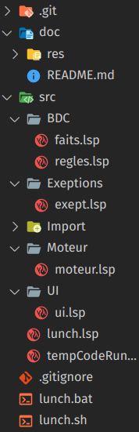

# Info805-TP
TP d'info 805 - Réalisation d'un systeme expert en lisp

## Idées 
- Système de recherche de pokémon
    + Recherche d'un pokémon en rentrant ses caractéristique / nom ou type
        ``` carac|nom|type => pokémon ```
    + Recherche des pokémons efficaces contre un autre
        ``` pokémon => pokémon[] ```
    + Donner les caractéristiques d'un pokémon
        ``` pokémon => carac + type ```
    + Trouver les évolutions précédentes / parents
        ``` pokémon => pokémon[] ```
    + Trouver les conditions pour évoluer
        ``` pokémon => condition[] ```
    + Recherche d'attaque efficace
        ``` Attaque => Attaque[] ```
    + Rechercher les zones d'apparition d'un pokémon 
        ``` pokémon => zone[] ```
        ``` zone => boolean ```

## Architecture
L'architecture de ce projet est la suivante :
| Architecture | Explications |
|---|---|
|  | Dans le dossier doc se trouve toute la documentation (dont ce fichier) <br> Le dossier src contient tout le code source du projet, répartit comme suit : <br> - BDC => Base De Connaissances, regroupe les faits et les règles du système <br> - Exeptions => gère toutes les erreurs et exeptions que nous pouvons rencontrer <br> - Moteur => Moteur d'inférence du système, récupère une requète et récupère les faits, en fonctions des règles établies <br> - UI => Interface Utilisateur, permet d'afficher les résultat du moteur d'inférence, mais lui communique également les requètes <br> les trois fichiers lunch servent à lancer le projet. Le fichier lunch.lsp sert à installer les dépendances du projet + appeler la méthode main. Les fichiers lunch.bat et lunch.sh permettent, quand à eux, de lancer le projet sans effort, respectivement sous Windows et sous linux. |

## Schémas de la base de fait
cf : Miro => https://miro.com/app/board/uXjVPphY1Nw=/